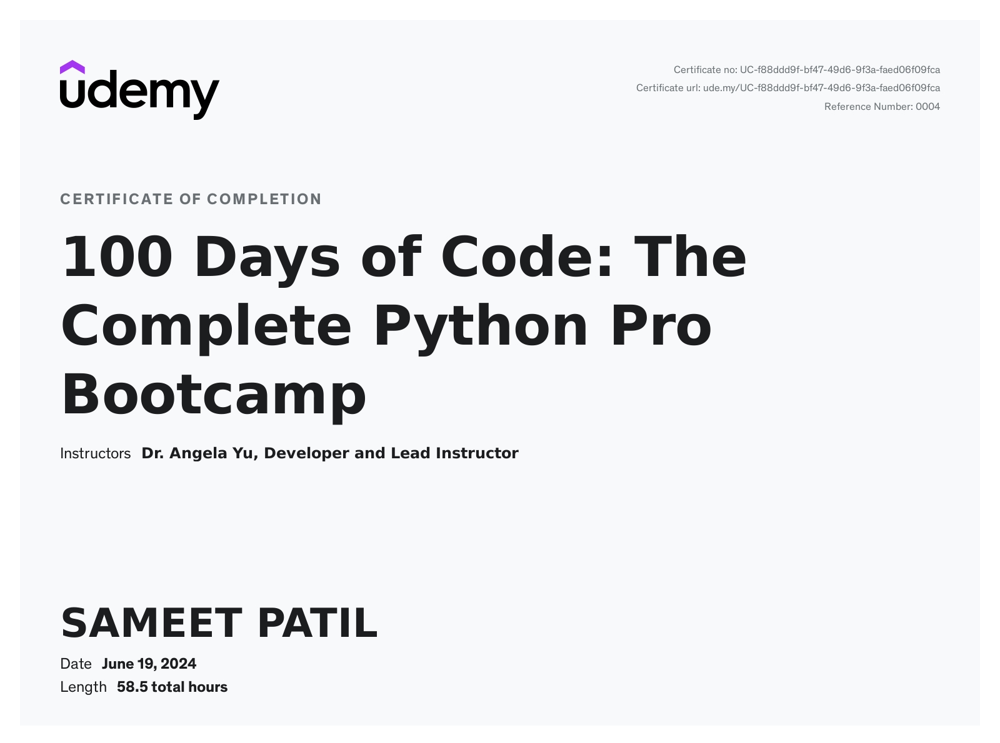

# 🐍 100 Days of Python - Projects Showcase 🚀

🌟 Welcome to my journey through the **[100 Days of Code: The Complete Python Pro Bootcamp](https://www.udemy.com/course/100-days-of-code/)** by Angela Yu on Udemy! 🌟

This repository is a collection of **100 Python projects** I built during this amazing course. Each project demonstrates practical applications of Python programming, from beginner-level tasks to advanced concepts.

---

## 🎯 **Course Highlights**

✅ **Comprehensive Python Skills**: From basics to advanced topics like web scraping, GUI development, and data science.  
✅ **Hands-On Learning**: 100 real-world projects, including games, web apps, and automation scripts.  
✅ **Tech Stack Mastery**: Tools and libraries like Flask, Selenium, Pandas, NumPy, Matplotlib, and more.  
✅ **Creative Problem-Solving**: Fun challenges like building Snake, Pong, and other interactive games.  

---

## 📂 **Repository Structure**

Each folder represents a day's project(s). Here's a sneak peek:

```plaintext
📁 Day 1 - Beginner Level
   ├── Hello World
   └── Band Name Generator

📁 Day 2 - Data Types and Variables
   ├── Tip Calculator

📁 Day 3 - Control Flow and Logical Operators
   ├── Treasure Island Game

...

📁 Day X - Advanced Projects (Complex)
   ├── Web Scraper
   ├── Flask Blog
   ├── Data Visualization with Matplotlib
```

> **Note:** For days with more complex projects, I’ve included virtual environments and additional setup instructions.

---

## 🌟 **Featured Projects**

Here are some of the standout projects from the journey:

- 🎮 **Snake Game**: A classic arcade game built with Python and Turtle graphics.  
- 🕹️ **Pong Game**: Multiplayer Pong game with dynamic difficulty.  
- 🛠️ **Web Scraper**: Automated data extraction from websites using Selenium.  
- 📊 **Data Analysis**: Exploratory data analysis with Pandas and Matplotlib.  
- 🌐 **Flask Blog**: A full-stack web application with Flask and Jinja templates.  

---

## 🛠️ **How to Run the Projects**

1. Clone this repository:

   ```bash
   git clone https://github.com/sameetpatil_5/100-days-python-projects.git
   cd 100-days-python-projects
   ```

2. Navigate to the project folder of your choice:

   ```bash
   cd day-x/project-name
   ```

3. If the project requires a virtual environment, activate it:

   ```bash
   source venv/bin/activate   # For macOS/Linux
   .\venv\Scripts\activate    # For Windows
   ```

4. Run the Python script:

   ```bash
   python main.py
   # Or the Python file for that project,
   # eg. python PasswordGenerator.py
   ```

---

## 🎉 **Completion Certificate**

  
> Proud to have completed this journey and earned the certificate of completion! 🏆

---

## 🤝 **Acknowledgments**

- Huge thanks to **Angela Yu** for creating such an engaging and comprehensive course.  
- Shoutout to the amazing community of learners who made this journey even more inspiring! 🙌  

---

## 📢 **Connect with Me**

If you liked this repository, feel free to reach out!  
💼 [LinkedIn](https://www.linkedin.com/in/sameetpatil5/)  
✍️ [Medium](https://medium.com/@sameetpatil5)  
🐦 [Twitter](https://x.com/SAMEETPATIL5)  

---

_*#Python #100DaysOfCode #Udemy #Programming #WebDevelopment #DataScience #MachineLearning*_
